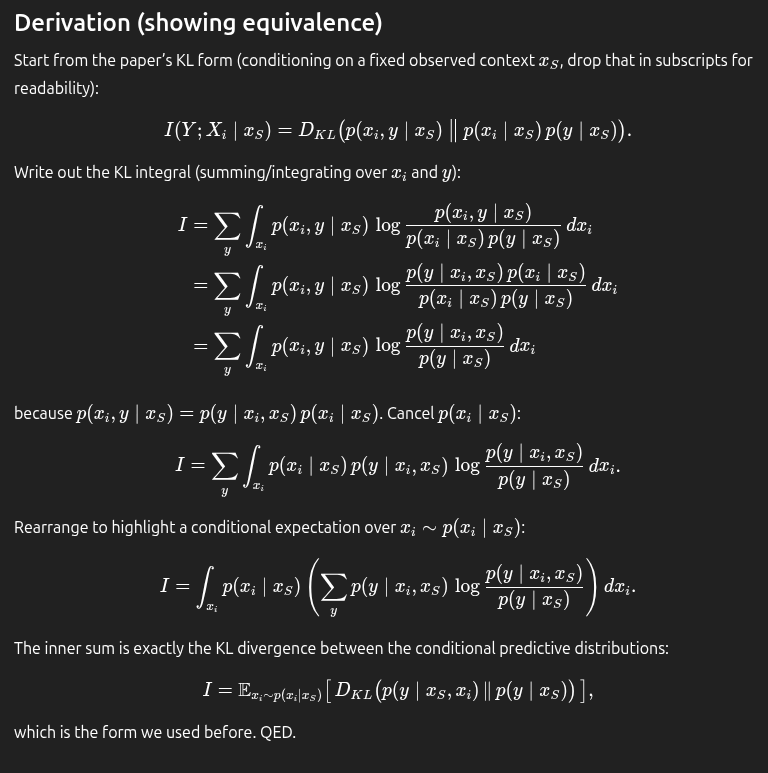

COMPLETED:

img cls.

- better training augmentations

- focal loss for training to address class imbalance

tta

TODO:

easy metadata fusion strategies

- https://openaccess.thecvf.com/content/WACV2022/papers/Picek_Danish_Fungi_2020_-_Not_Just_Another_Image_Recognition_Dataset_WACV_2022_paper.pdf

just count the number of samples 

- train xgboost with metadata only

then multiply: image-only class predictions * metadata-only class predictions 

we can smooth metadata-only class predictions since they are not that accurate and calibrated

active feature acquisition

- loss based (image only classifier): metadata is too sparse for now, we cannot do anything with them. this is a good starting point

- also combine loss based selection with cmi / cost based selection (requires imputation model, transformer mae  like training. use test and validation!)

here x_i: missing features, x_s: available features
divide the cmi by the cost

first, train p(x_i | x_s) model: xgboost could be a good option for the tabular data but we also have image input. so, vit can be a good option, mae like training.

then, train p(y | x_i, x_s) model: vit can be a good option. oscar is doing it.
    sometimes use -1 masked embedding for the missing features. 
    sometimes use predicted x_i from the trained p(x_i | x_s) model for the missing features.

then use this model acquire features using cmi / cost

final day:

- use testset pseudolabels + validation set to train classifier more. also, don't use the -1 masked embeddings anymore (test-train mismatch).